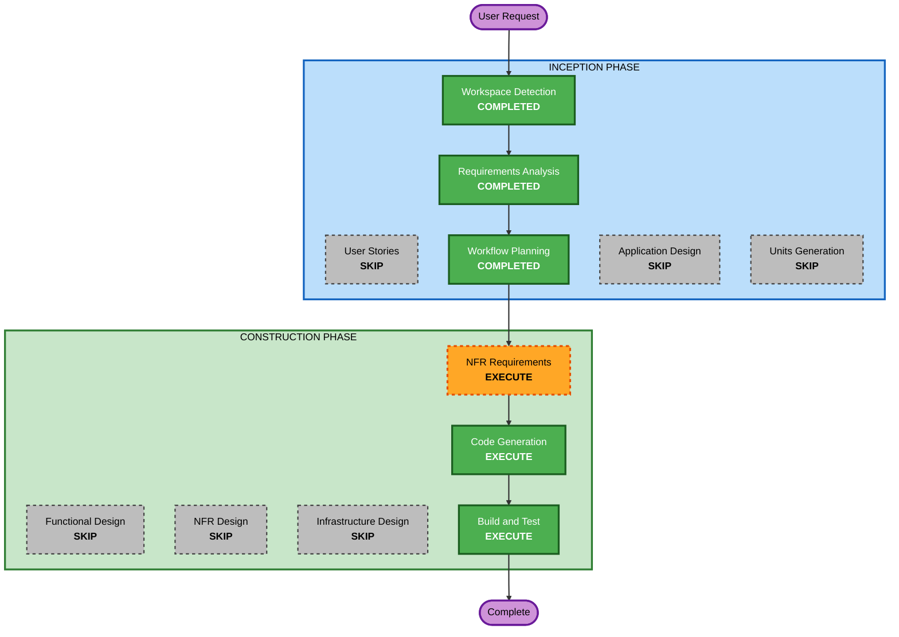

# Execution Plan

## Detailed Analysis Summary

### Transformation Scope
- **Project Type**: Greenfield
- **Transformation Type**: New single-component static web application
- **Primary Changes**: Markdown入力画面とプレビュー画面を分離できるUIを持つ静的アプリの新規作成
- **Related Components**: N/A（既存コンポーネントなし）

### Change Impact Assessment
- **User-facing changes**: Yes（入力/プレビュー切り替えUI）
- **Structural changes**: Yes（新規静的サイト構成）
- **Data model changes**: No
- **API changes**: No
- **NFR impact**: Yes（入力安全化、GitHub Pages互換、軽量表示切替）

### Risk Assessment
- **Risk Level**: Low
- **Rollback Complexity**: Easy
- **Testing Complexity**: Simple

## Workflow Visualization

### Text Alternative
- Inception: Workspace Detection (completed) -> Requirements Analysis (completed) -> Workflow Planning (completed)
- Inception conditional: User Stories skip, Application Design skip, Units Generation skip
- Construction: NFR Requirements execute -> Code Generation execute -> Build and Test execute
- Construction conditional skip: Functional Design, NFR Design, Infrastructure Design

## Phases to Execute

### INCEPTION PHASE
- [x] Workspace Detection (COMPLETED)
- [x] Requirements Analysis (COMPLETED)
- [x] Workflow Planning (COMPLETED)
- [ ] User Stories - SKIP
  - **Rationale**: シンプルな単一ユースケースで受け入れ条件が要件内で明確
- [ ] Application Design - SKIP
  - **Rationale**: 新規コンポーネント設計が単純で、コード生成計画内で十分定義可能
- [ ] Units Generation - SKIP
  - **Rationale**: 単一ユニット構成で分割不要

### CONSTRUCTION PHASE
- [ ] Functional Design - SKIP
  - **Rationale**: 複雑な業務ロジックがなく、設計複雑度が低い
- [ ] NFR Requirements - EXECUTE
  - **Rationale**: Security/PBT拡張有効化済みで、NFR観点の明文化が必要
- [ ] NFR Design - SKIP
  - **Rationale**: NFR実装が軽量で、独立した設計文書を要しない
- [ ] Infrastructure Design - SKIP
  - **Rationale**: GitHub Pages静的配信で追加インフラ設計なし
- [ ] Code Generation - EXECUTE (ALWAYS)
  - **Rationale**: 実装計画とコード生成が必須
- [ ] Build and Test - EXECUTE (ALWAYS)
  - **Rationale**: テスト手順整備と最終検証が必須

### OPERATIONS PHASE
- [ ] Operations - PLACEHOLDER
  - **Rationale**: 現行ワークフローではプレースホルダー

## Estimated Timeline
- **Total Executed Stages Remaining**: 3
- **Estimated Duration**: Short

## Success Criteria
- **Primary Goal**: GitHub Project Pagesで動作する見やすいMarkdownプレビューアプリを作成する
- **Key Deliverables**:
  - 入力/プレビュー分離UIを備えた静的ページ
  - HTMLエスケープによる基本安全対策
  - 実行可能なビルド/テスト手順書
- **Quality Gates**:
  - Security拡張ルールの該当項目を満たす
  - PBT拡張ルールの該当項目を満たす（適用対象は最小）
  - GitHub Pages互換の相対パス構成

## Extension Rule Compliance Summary (Workflow Planning Stage)
- **Security Baseline**: Compliant
  - Applicable: SECURITY-11（セキュア設計方針）
  - N/A at this stage: SECURITY-01/02/03/04/05/06/07/08/09/10/12/13/14
- **Property-Based Testing**: Compliant
  - Applicable: PBT-09（NFR RequirementsをEXECUTEとしてフレームワーク選定を確実化）
  - N/A at this stage: PBT-01/02/03/04/05/06/07/08/10
